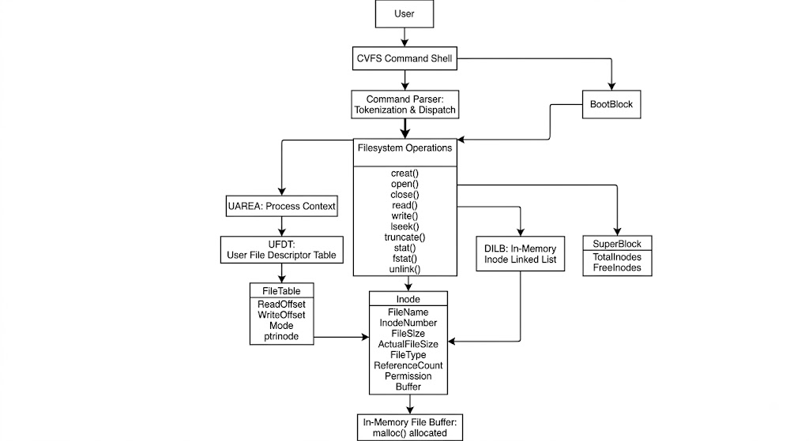
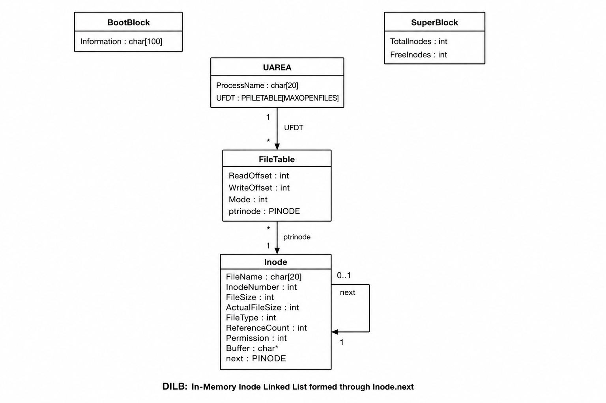
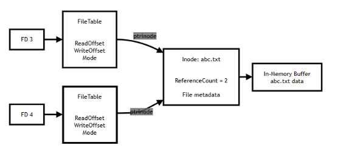
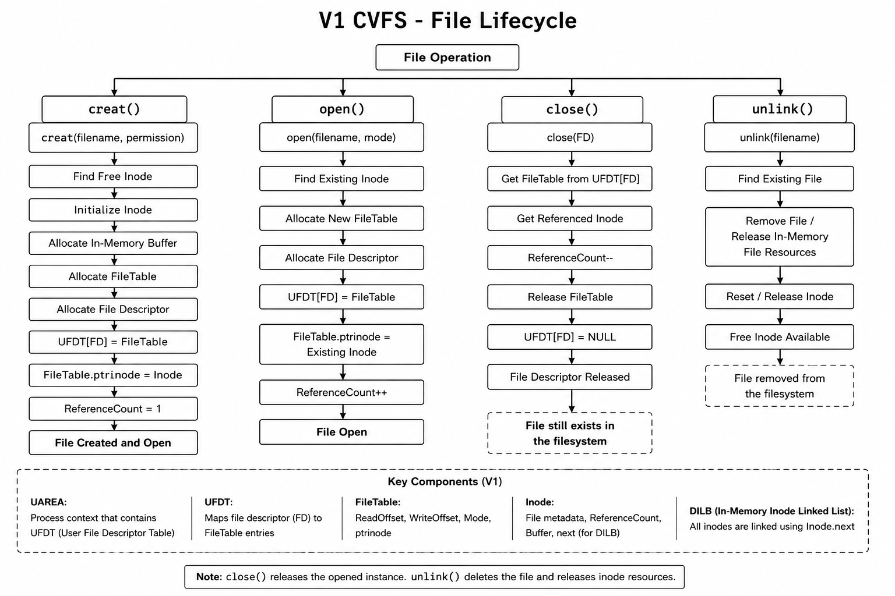
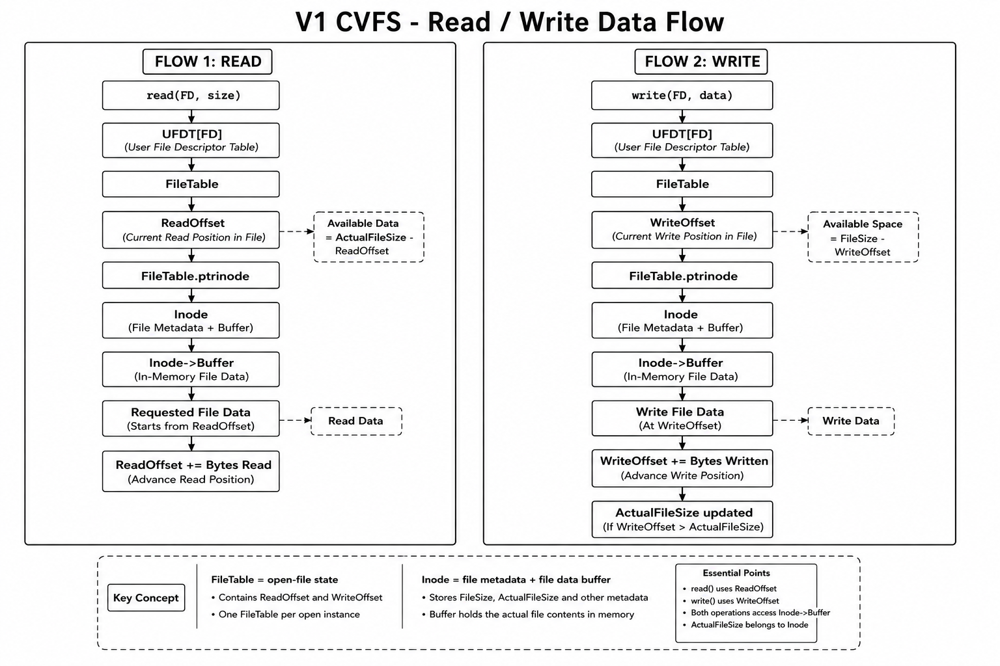
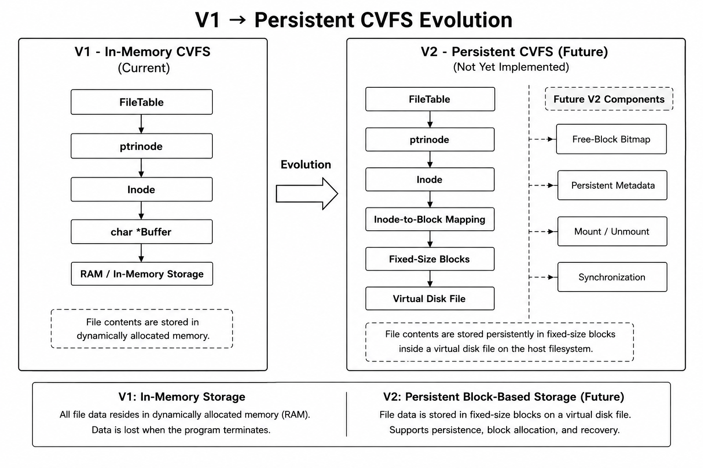

# V1 - In-Memory Virtual File System

An educational virtual file system implemented in C to understand how core filesystem components work internally.

V1 implements the core filesystem layer using **in-memory storage**. It includes inode-based file management, file descriptors, file tables, permissions, file offsets, metadata operations, and a custom command shell.

> **V1 is an in-memory filesystem.**
>
> File contents are stored in dynamically allocated memory. There is no virtual disk or persistent block storage in this version.

---

## Overview

The goal of V1 is to implement the basic internal components of a filesystem instead of relying directly on the operating system's filesystem APIs.

The filesystem is built around the following components:

- Inodes
- SuperBlock
- In-memory inode linked list (DILB)
- UAREA
- UFDT
- FileTable
- File descriptors
- File permissions
- Read and write offsets
- In-memory file buffers
- Custom command shell

The main relationship is:

```text
User
  |
  v
CVFS Command Shell
  |
  v
Filesystem Operations
  |
  v
UFDT
  |
  v
FileTable
  |
  v
Inode
  |
  v
In-Memory File Buffer
```

---

# 1. Overall Architecture

The following diagram shows the overall architecture of the V1 in-memory CVFS.



---

# 2. Core Data Structures

The following diagram shows the main structures used by the V1 filesystem.



## BootBlock

Stores basic boot information used during initialization.

```c
struct BootBlock
{
    char Information[100];
};
```

## SuperBlock

Stores global inode information.

```c
struct SuperBlock
{
    int TotalInodes;
    int FreeInodes;
};
```

The V1 filesystem initializes:

```text
TotalInodes = MAXINODE
FreeInodes  = MAXINODE
```

## Inode

An inode represents a file and stores its metadata and in-memory data buffer.

Important fields:

| Field | Purpose |
|---|---|
| `FileName` | Name of the file |
| `InodeNumber` | Unique inode number |
| `FileSize` | Allocated file capacity |
| `ActualFileSize` | Current logical file size |
| `FileType` | Type of the file |
| `ReferenceCount` | Number of active references |
| `Permission` | File permissions |
| `Buffer` | Pointer to the in-memory file data |
| `next` | Pointer to the next inode |

## FileTable

A FileTable represents an opened instance of a file.

```c
struct FileTable
{
    int ReadOffset;
    int WriteOffset;
    int Mode;
    PINODE ptrinode;
};
```

It stores:

- `ReadOffset` - current read position
- `WriteOffset` - current write position
- `Mode` - mode in which the file was opened
- `ptrinode` - pointer to the corresponding inode

## UAREA and UFDT

`UAREA` stores process-level filesystem information.

```c
struct UAREA
{
    char ProcessName[20];
    PFILETABLE UFDT[MAXOPENFILES];
};
```

The **UFDT (User File Descriptor Table)** maps file descriptors to FileTable entries.

---

# 3. FD → FileTable → Inode



The relationship between a file descriptor, FileTable, and inode is one of the most important concepts in V1.

```text
FD
 |
 v
UFDT[FD]
 |
 v
FileTable
 |
 | ptrinode
 v
Inode
 |
 v
Buffer
```

Multiple file descriptors can refer to the same inode through separate FileTable entries.

For example:

```text
FD 3 ──→ FileTable 3 ──┐
                       ├──→ abc.txt Inode
FD 4 ──→ FileTable 4 ──┘
```

In this situation:

```text
ReferenceCount = 2
```

The two FileTables can maintain their own offsets and modes, while both refer to the same inode.

---

# 4. File Lifecycle



V1 handles file creation, opening, closing, and deletion as separate operations.

## `creat()`

`creat()` creates a new file and, in the V1 design, also creates its initial opened instance.

The main steps are:

1. Check inode availability.
2. Validate permissions.
3. Check whether the file already exists.
4. Find a free inode.
5. Find a free UFDT entry.
6. Allocate a FileTable.
7. Connect the FileTable to the inode.
8. Initialize inode metadata.
9. Allocate the in-memory file buffer.
10. Decrease `FreeInodes`.
11. Return the file descriptor.

Conceptually:

```text
creat()
   |
   v
New Inode
   |
   +── Buffer
   |
   +── FileTable
   |
   +── File Descriptor
   |
   v
ReferenceCount = 1
```

## `open()`

`open()` opens an existing file.

Unlike `creat()`, it does not create a new inode.

Conceptually:

```text
Existing Inode
      |
      v
New FileTable
      |
      v
New File Descriptor
      |
      v
ReferenceCount++
```

The inode is shared, while the new FileTable represents the new open instance.

## `close()`

`close()` closes an open file descriptor.

The main steps are:

```text
FD
 |
 v
UFDT[FD]
 |
 v
FileTable
 |
 +── ReferenceCount--
 |
 +── Release FileTable
 |
 +── UFDT[FD] = NULL
```

Closing a file does **not** mean deleting the file.

The file remains available through the filesystem until it is removed.

## `unlink()`

`unlink()` removes the file from the V1 filesystem and releases its in-memory resources.

Conceptually:

```text
File
 |
 v
Release File Buffer
 |
 v
Reset Inode
 |
 v
Free Inode
```

---

# 5. Read / Write Data Flow



V1 maintains separate read and write offsets inside the FileTable.

## Read Path

```text
FD
 |
 v
UFDT
 |
 v
FileTable
 |
 v
ReadOffset
 |
 v
Inode
 |
 v
Buffer
 |
 v
Data
```

Before reading, V1 checks the amount of data available:

```text
Available Data = ActualFileSize - ReadOffset
```

Data is read from the buffer starting at the current `ReadOffset`.

After a successful read:

```text
ReadOffset += Bytes Read
```

## Write Path

```text
FD
 |
 v
UFDT
 |
 v
FileTable
 |
 v
WriteOffset
 |
 v
Inode
 |
 v
Buffer
```

Before writing, V1 checks the available file capacity:

```text
Available Space = MAXFILESIZE - WriteOffset
```

Data is written starting from the current `WriteOffset`.

After a successful write:

```text
WriteOffset += Bytes Written
ActualFileSize += Bytes Written
```

The important distinction is:

```text
Read  → ReadOffset
Write → WriteOffset
```

Both offsets belong to the FileTable.

---

# 6. `stat()` vs `fstat()`

vsfstat().png)

Both operations return file metadata, but they locate the inode differently.

## `stat()`

`stat()` identifies the file using its filename.

```text
Filename
   |
   v
Search Inode List
   |
   v
Matching Inode
   |
   v
File Metadata
```

The metadata includes:

- File name
- Inode number
- File size
- Actual file size
- Reference count
- Permission
- File type

## `fstat()`

`fstat()` identifies the file using an already-open file descriptor.

```text
FD
 |
 v
UFDT
 |
 v
FileTable
 |
 v
ptrinode
 |
 v
Inode
 |
 v
File Metadata
```

## Main Difference

| Operation | Lookup path |
|---|---|
| `stat()` | Filename → Inode |
| `fstat()` | FD → UFDT → FileTable → Inode |

The important idea is:

```text
stat()
    uses the filename

fstat()
    uses the file descriptor
```

---

# 7. `lseek()`

`lseek()` changes the current file position of an open file.

V1 defines three positioning modes:

```c
#define START   0
#define CURRENT 1
#define END     2
```

The FileTable contains separate offsets:

```text
FileTable
 ├── ReadOffset
 └── WriteOffset
```

The positioning modes are:

```text
START
  → position relative to the beginning

CURRENT
  → position relative to the current position

END
  → position relative to the end
```

The important point is that the offset state belongs to the **FileTable**, not directly to the inode.

---

# 8. `truncate()`

`truncate()` changes the logical size of an existing file.

V1 uses two size-related fields:

```text
FileSize
    = allocated capacity

ActualFileSize
    = current logical file size
```

For example:

```text
FileSize       = 50
ActualFileSize = 20
```

After:

```text
truncate(file, 10)
```

the logical file size becomes:

```text
ActualFileSize = 10
```

Because V1 uses in-memory storage, there are no disk blocks to release.

---

# File Permissions

V1 defines the following permission values:

```c
READ    = 1
WRITE   = 2
EXECUTE = 4
```

The currently supported creation permissions are:

| Value | Permission |
|---:|---|
| `1` | READ |
| `2` | WRITE |
| `3` | READ + WRITE |

Read and write operations validate the required permission before accessing the file.

---

# In-Memory Storage

V1 stores file data directly in memory.

```text
Inode
  |
  | Buffer
  v
+------------------+
| In-Memory Data   |
+------------------+
```

The inode contains:

```c
char *Buffer;
```

When a file is created, memory is allocated for its file buffer.

The V1 storage model is therefore:

```text
Inode
  |
  v
Buffer
  |
  v
RAM
```

There is no persistent storage layer in V1.

V1 does **not** contain:

- Virtual disk file
- Disk block allocation
- Free-block bitmap
- Inode-to-block mapping
- Persistent metadata
- Mount operation
- Unmount operation
- Crash recovery
- Disk synchronization

The filesystem state exists only while the program is running.

---

# Filesystem Limits

V1 intentionally uses small fixed limits.

```c
#define MAXINODE      5
#define MAXFILESIZE   50
#define MAXOPENFILES  5
```

| Limit | Value | Meaning |
|---|---:|---|
| Maximum inodes | `5` | Maximum number of inode entries |
| File capacity | `50` bytes | Initial capacity of a file |
| UFDT size | `5` | Maximum number of UFDT entries |

File descriptors are searched starting from `FD 3`.

With the current configuration, the filesystem-managed descriptors are:

```text
FD 3
FD 4
```

---

# SuperBlock and Inode Management

At initialization:

```text
TotalInodes = 5
FreeInodes  = 5
```

When a file is created:

```text
FreeInodes--
```

When a file is deleted:

```text
FreeInodes++
```

The inode structures are connected through the `next` pointer, forming the in-memory inode linked list.

```text
head
 |
 v
Inode → Inode → Inode → Inode → Inode
```

This list is used for locating files and managing the available inodes.

---

# Initialization

V1 initializes its main filesystem structures before starting the command shell.

```text
Program Start
      |
      v
BootBlock
      |
      v
UAREA
      |
      v
SuperBlock
      |
      v
DILB / Inode List
      |
      v
CVFS Command Shell
```

The initialization function is:

```c
StartAuxiliaryDataInitialisation()
```

It initializes the BootBlock, UAREA, SuperBlock, and in-memory inode list.

---

# Command Shell

V1 provides a custom command shell for interacting with the filesystem.

The shell performs the following steps:

```text
Read Command
     |
     v
Tokenize Input
     |
     v
Identify Command
     |
     v
Call Filesystem Operation
     |
     v
Display Result
```

Example prompt:

```text
Marvellous CVFS : >
```

The shell supports command parsing and dispatch for the filesystem operations.

---

# Commands

| Command | Purpose |
|---|---|
| `help` | Display available commands |
| `man` | Display command information |
| `creat` | Create a new file |
| `open` | Open an existing file |
| `close` | Close an open file descriptor |
| `read` | Read file data |
| `write` | Write file data |
| `lseek` | Change file offset |
| `truncate` | Change logical file size |
| `stat` | Display file metadata by name |
| `fstat` | Display file metadata using a file descriptor |
| `ls` | List existing files |
| `unlink` | Delete a file |
| `clear` | Clear the terminal |
| `exit` | Exit CVFS |

---

# Error Handling

V1 uses explicit error codes to handle filesystem failures.

```c
ERR_INVALID_PARAMETER
ERR_NO_INODES
ERR_FILE_ALREADY_EXIST
ERR_FILE_NOT_EXIST
ERR_PERMISSION_DENIED
ERR_INSUFFICIENT_SPACE
ERR_INSUFFICIENT_DATA
ERR_MAX_FILES_OPEN
```

These errors cover situations such as:

- Invalid parameters
- Invalid file descriptors
- No free inode
- File already exists
- File does not exist
- Permission denied
- Insufficient file capacity
- Insufficient data for reading
- Maximum number of open files reached

---

# Key Concepts to Remember

## 1. Inode

The inode represents the file.

```text
Inode
 ├── FileName
 ├── InodeNumber
 ├── FileSize
 ├── ActualFileSize
 ├── FileType
 ├── ReferenceCount
 ├── Permission
 └── Buffer
```

## 2. FileTable

The FileTable represents an open instance of a file.

```text
FileTable
 ├── ReadOffset
 ├── WriteOffset
 ├── Mode
 └── ptrinode
```

## 3. UFDT

The UFDT connects file descriptors to FileTables.

```text
FD
 |
 v
UFDT[FD]
 |
 v
FileTable
```

## 4. Inode List

The in-memory inode structures form a linked list:

```text
head
 |
 v
Inode → Inode → Inode → Inode → Inode
```

## 5. File Data

V1 stores file data in memory:

```text
Inode
  |
  v
Buffer
  |
  v
RAM
```

## 6. File Size

```text
FileSize
    = allocated capacity

ActualFileSize
    = current logical file size
```

## 7. Open File State

```text
FileTable
 ├── ReadOffset
 ├── WriteOffset
 └── Mode
```

The open-file state is stored in the FileTable.

---

# V1 → Persistent CVFS Evolution



V1 provides the core filesystem abstraction using in-memory storage.

The future persistent version will replace the memory-only storage model:

```text
V1

Inode
  |
  v
Memory Buffer
```

with a block-based storage model:

```text
Future V2

Inode
  |
  v
Block Mapping
  |
  v
Fixed-Size Blocks
  |
  v
Virtual Disk
```

The planned persistent layer can introduce:

- Virtual disk file
- Fixed-size blocks
- Free-block bitmap
- Inode-to-block mapping
- Persistent metadata
- Mount / unmount
- Synchronization

These are **future features** and are not part of V1.

---

# V1 Scope

## Implemented

- Inode-based file management
- SuperBlock
- Free-inode tracking
- In-memory inode linked list
- UAREA
- UFDT
- FileTable
- File descriptors
- File permissions
- File creation
- File opening
- File closing
- Reading
- Writing
- Separate read/write offsets
- `lseek()`
- `truncate()`
- `stat()`
- `fstat()`
- File deletion
- Custom command shell
- Error handling

## Not Included in V1

- Persistent storage
- Virtual disk
- Disk blocks
- Free-block bitmap
- Inode-to-block mapping
- Persistent metadata
- Mount / unmount
- Crash recovery
- Disk synchronization

---

# Project Structure

```text
V1-InMemory-CVFS/
│
├── CVFS.c
├── README.md
│
└── images/
    ├── overall-architecture.jpg
    ├── CoreDataStructures.png
    ├── FileTable.png
    ├── V1CVFS-FileLifecycle.png
    ├── ReadWriteDataFlow.png
    ├── stat()vsfstat().png
    └── PersistentCVFSEvolution.png
```

---

# What V1 Demonstrates

This project demonstrates how the basic components of a filesystem can be implemented directly in C.

The main concepts are:

- Inode-based file management
- File descriptor management
- FileTable management
- Reference counting
- File permissions
- File offsets
- Metadata management
- Dynamic memory allocation
- Linked-list based inode management
- File lifecycle
- Command parsing
- Error handling
- Separation of file metadata from open-file state

---

# Future Direction

V1 establishes the core filesystem layer.

The next version will extend the existing architecture with persistent block-based storage.

The intended evolution is:

```text
V1
In-Memory CVFS
     |
     v
Persistent V2
     |
     +── Virtual Disk
     +── Fixed-Size Blocks
     +── Free-Block Bitmap
     +── Inode-to-Block Mapping
     +── Persistent Metadata
     +── Mount / Unmount
     +── Synchronization
```

The goal is to preserve the core V1 abstractions while adding persistence underneath them.

---

## Version

| Property | Value |
|---|---|
| Version | V1 |
| Language | C |
| Storage | In-memory |
| Persistence | Not supported |
| Filesystem model | Inode-based |
| Status | Core filesystem implementation |